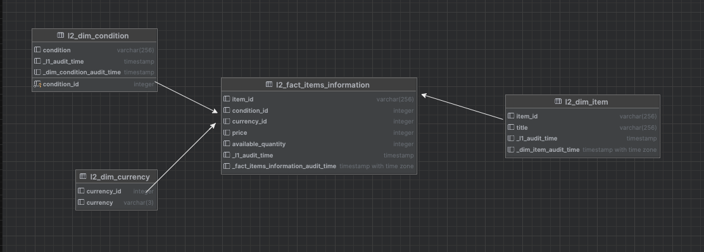

# Tp Final Python Data Applications

# Analisis de productos de la categoria Consolas y Videojuegos 

## Introducción

Este proyecto utiliza Docker Compose para levantar airflow y fue diseñado para automatizar la extracción diaria de datos de items de consolas y videojuegos desde la API de MercadoLibre. Utilizando herramientas como Apache Airflow, Redshift, y Docker, el pipeline recopila información sobre precios, stocks y si los productos son nuevos o usados. Los datos luego son transformados y cargados en Redshift para facilitar su modelado y análisis, permitiendo un estudio continuo del mercado de videojuegos.

Este proyecto 

## Caracteristicas del proyecto

- Integración con API: Se conecta diariamente a la API de MercadoLibre.
- Extracción de datos: Extrae datos diarios de precio y stock de los items de la categoria consolas y videojuegos
- Creación de tablas: Crea tablas en Redshift para almacenar los datos de stock.
- Carga en Redshift: Los datos transformados son cargados en Redshift para consultas y análisis futuros.
- Transformación de datos: Los datos son limpiados y preparados para análisis.
- Pruebas unitarias: Se hacen pruebas de linting y test unitarios para garantizar la calidad del código.

### Qué insights podemos obtener con esta data?

A continuación defino diferentes preguntas de negocio que se podrían responder a partir de esta base de datos

	1.  Cómo es la evolución de las ventas de consolas y videojuegos a lo largo de los dias y cual es la tendencia de dicha evolución?
	2.  Cuál es la diferencia en % de los precios entre el primer y ultimo dia?
	3.  Existen patrones estacionales en las ventas de consolas y videojuegos?
	4.  Cuál fue el mes con mayor cantidad de ventas de consolas y videojuegos en el periodo analizado?	

## Set Up

Es requisito tener Docker y Docker Compose instalados.

1. Clonar el repositorio:
```git clone https://github.com/melissaherszage/items_inventory.git```

2. Navegar al directorio del proyecto:
```cd items_inventory```

3. Levantar los servicios usando Docker Compose:
```docker-compose up -d```

4. Acceder a la interfaz de Airflow para monitorear el pipeline y verificar la ejecución de los DAGs.
```http://localhost:8080```
- Username: airflow
- Password: airflow

5. Configura una nueva conexión en Airflow:
- Ir a Admin -> Connections.
- Crea una nueva conexión con los siguientes detalles:
    - Connection Id: redshift_default
    - Connection Type: Postgres (ojo! no es redshift)
    - Host: redshift-pda-cluster.cnuimntownzt.us-east-2.redshift.amazonaws.com
    - Database: pda
    - Port: 5439
    - User: 2024_melissa_herszage
    - Password: Contactarme a meliherszage@gmail.com para obtener la contraseña.

## Funte de datos

Se utilizo un codigo de python para traer data de la API de Mercado Libre
```https://api.mercadolibre.com/sites/MLA/categories```

La API de MercadoLibre es una API REST que permite a los desarrolladores interactuar con los diferentes recursos del ecosistema de MercadoLibre. Esto incluye funcionalidades como la gestión de usuarios, artículos, pedidos, envíos y pagos. A través de esta API, puedes acceder a endpoints como /users, /items y /orders, lo que te permite automatizar tareas como listar productos, gestionar ventas, realizar consultas de stocks, precios y rastrear envíos.

## Estructura del repositorio

- dags/: Contiene los DAGs (Definiciones de flujo de trabajo) de Airflow.
- python_files/: Contiene todos los archivos de python necesarios para ejecutar las tareas del dag de ELT
    - lib/: Contiene scripts Python de soporte para conexiones y transformaciones de datos.
- sql_files/: Almacena los archivos SQL para la transformación y carga de datos.
- docker-compose.yml: Define los servicios de Docker necesarios para levantar el entorno de Airflow

## Estructura del modelo de datos

### Estructura de tablas

El modelo esta dividido en dos capas: l1 y l2. En la capa l1 encontramos la data cruda como viene de la API, es decir, sin sufrir ninguna modificacion. Estas tablas son dos, items e item_prices.
La capa l2 contiene un modelo dimensional compuesto por una tabla de hechos y tres tablas de dimensiones que le dan contexto a los hechos.



#### Tablas de hechos

1. fact_items_information Almacena los datos de stock y precio de los items de forma diaria

#### Tablas de dimensiones

1. dim_item contiene la informacion y caracteristicas de los items (es lentamente cambiante)
2. dim_condition contiene los estados que puede tomar una condicion del item
3. dim_currency contiene la informacion de la moneda que puede tomar el precio de los items

## Pipeline

El modelado ELT esta compuesto por un dag elt.py que contiene tanto la extracción de datos de la API como las transformaciones para llegar al modelo dimensional.

### Scripts:
- create_table.sql: Verifica si las tablas ya existen en redshift y si no, las crea. 
- insert_items.py e insert_prices.py son dos scripts de python que corren los inserts necesarios en las tablas teniendo en cuenta que los items no existan ya en la tabla y que no haya data de hoy de los precios de los items.
- fact_items_information.sql y dim_item.sql son las queries que corren las transformaciones del modelo dimensional.

## Tests

La carpeta tests contiene dos pruebas unitarias y ademas, el workflow de github corre el linting.
- test_dag_id.py: Teste la funcion que crea el dag id a partir del nombre del archivo
- test_get_dag_sql_files.py: Testea si la funcion que busca los archivos dentro de la carpeta sql_files traiga el path correspondiente.

Estos tests se ejecutan cuando se hace un push o un pull request en github.
